# Salt-stack

Antes de comenzar la práctica crearemos dos máquinas virtuales OpenSuse, una llamada Máster y otra Minion.

Comenzamos instalando salt-master en la máquina Máster.

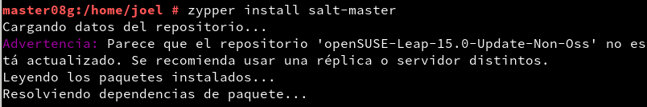

Una vez instalado iremos al archivo */etc/salt/master* e añadimos las siguientes líneas.

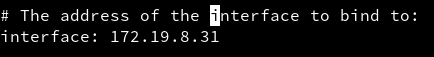

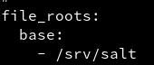

Habilitamos el servicio en el sistema y lo arrancamos.

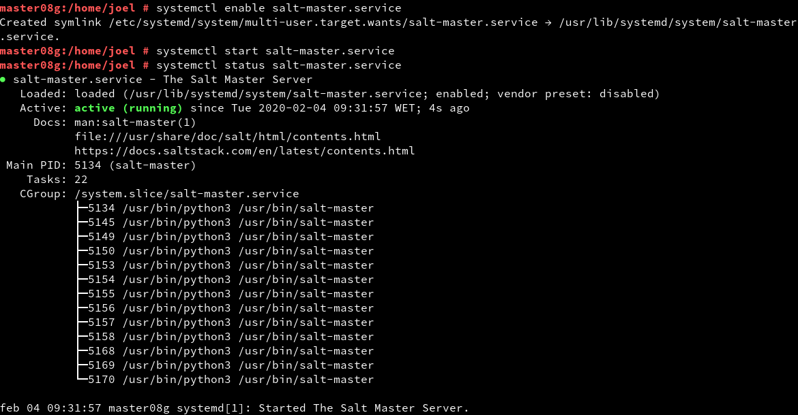

Ejecutamos el comando *salt-key -L* para ver los Minions aceptados por nuestro Máster. Comprobamos que aún no tenemos ninguna solicitud.

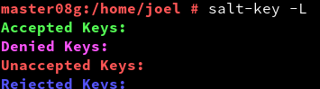

Ahora iremos a la máquina Minion e instalamos el servicio *salt-minion*

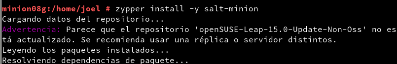

Modificaremos el archivo */etc/salt/minion* añadiendo la siguiente línea.

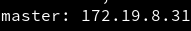

Habilitamos el servicio y lo arrancamos.

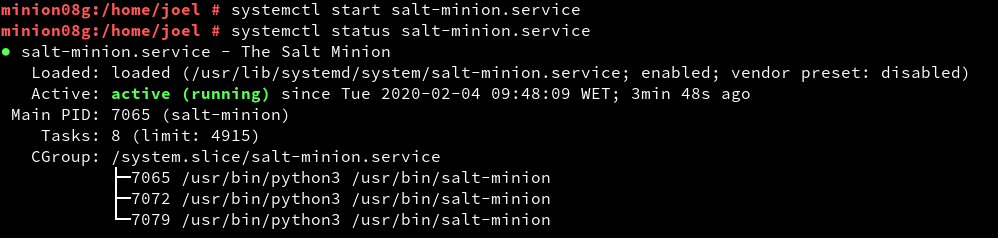

Luego comprobamos que no tenemos instalado apache2 en nuestro sistema.

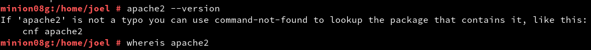

Volvemos a la máquina Máster y comprobamos que tenemos ya una petición del Minion.

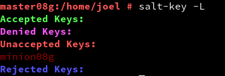

Y la aceptamos con el siguiente comando.

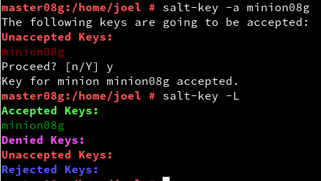

Ahora haremos pruebas de conectividad entre el Máster y el Minion.

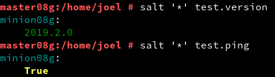

En el Máster crearemos los dos siguientes directorios.

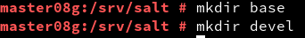

Y también creamos el archivo *roots.conf* en la ruta */etc/salt/master* con las siguientes líneas.

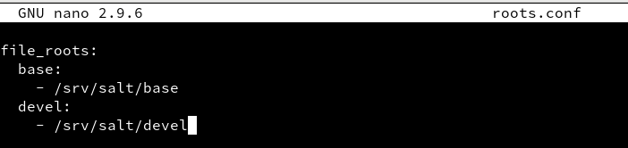

Reiniciamos el servicio y comprobamos que esté corriendo.

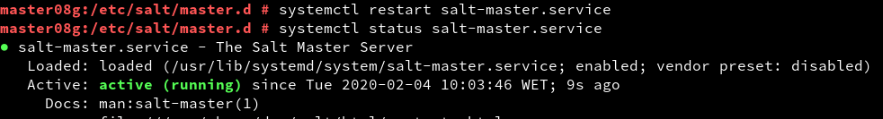

Para crear un nuevo estado crearemos el fichero */srv/salt/base/apache/init.sls* con el siguiente código.

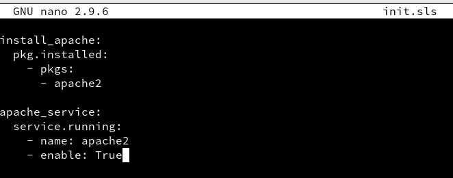

Y para asociar el estado anterior al Minion creamos el siguiente archivo en la ruta */srv/salt/base*.

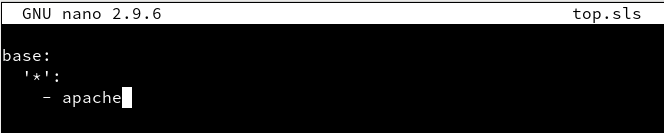

Comprobamos que el nuevo estado se ha añadido correctamente.

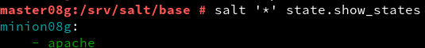

Ahora lo que haremos será aplicar este estado al Minion empezando por comprobar los estados en detalles.

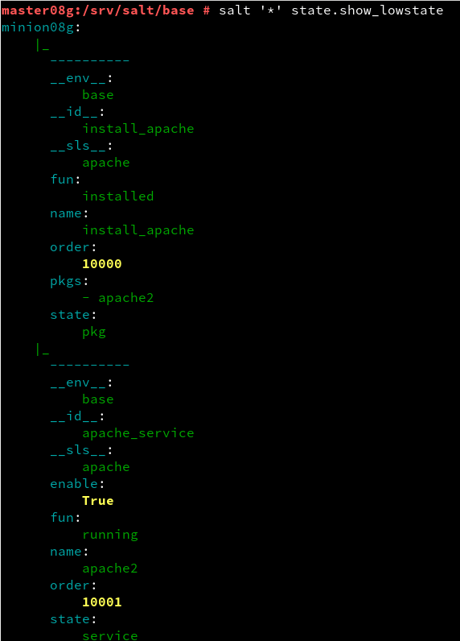

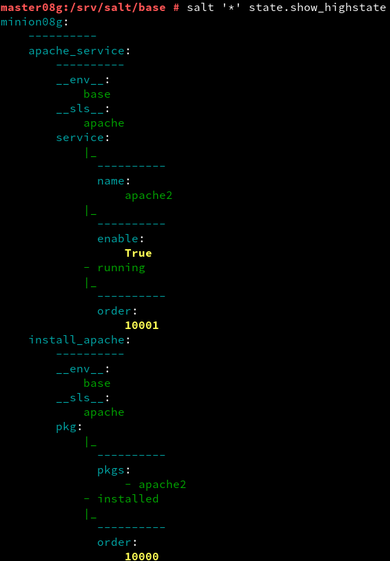

Y por último aplicando el estado.

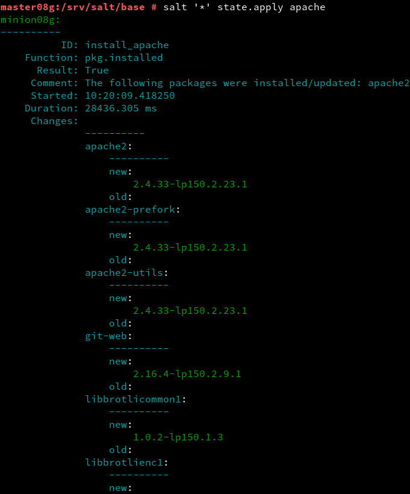

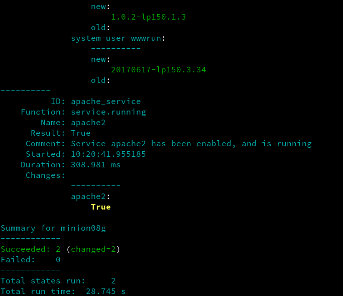

Ahora crearemos un nuevo estado que cree el grupo *Mazinger Z* junto a los usuarios *Koji08* y *Drinfierno08*.

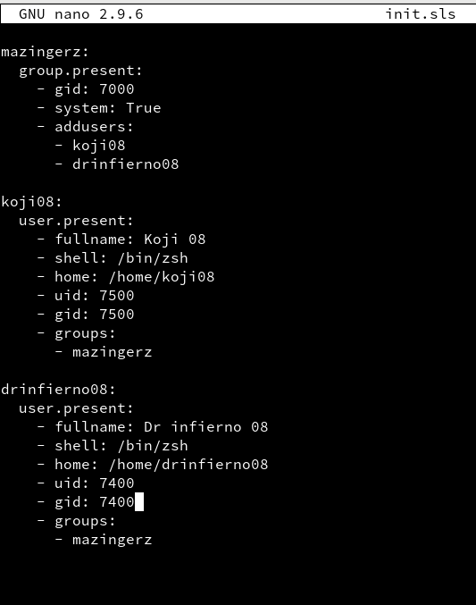

Añadimos el estado al fichero *top.sls*.

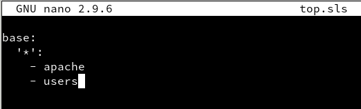

Y aplicamos al Minion.

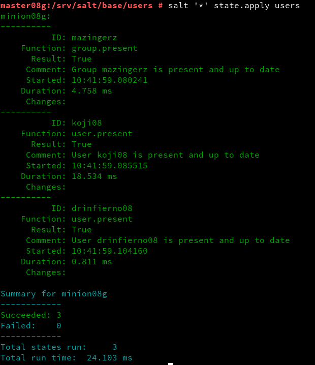

Por último crearemos otro estado que nos cree unas carpetas en el *Home* del usuario *Koji08*.

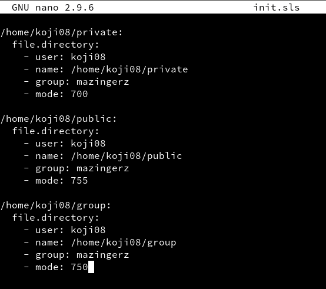

Añadimos al fichero como hicimos anteriormente para los demás estados.

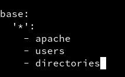

Y aplicamos.

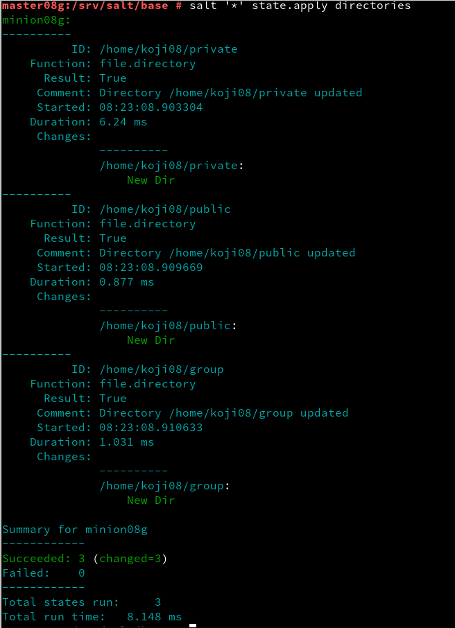

El último punto de la práctica consiste en instalar salt-minion en Windows y asociarlo al Máster.
Empezamos instalando el salt-minion.

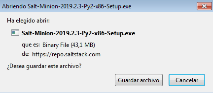

Pondremos la ip del Máster y nuestro nombre como Minion.

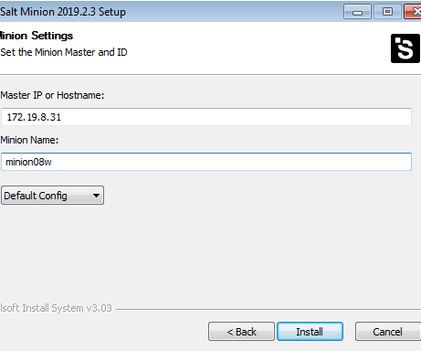

Iremos al Máster y comprobamos que tenemos la petición del Minion de Windows y la aceptamos.

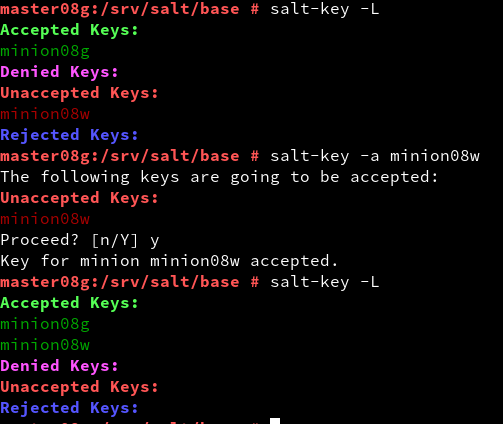
