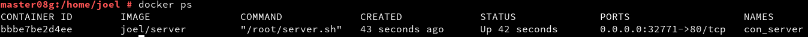
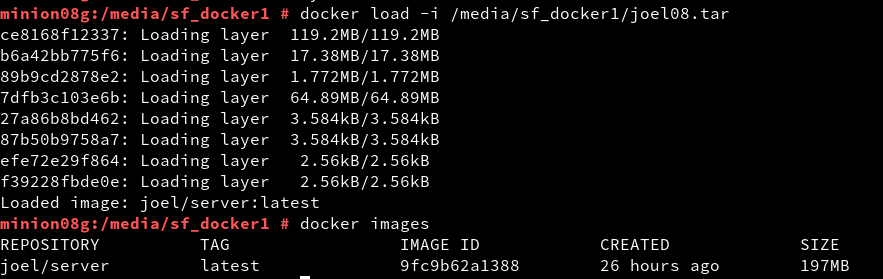

# Docker.

Primero comenzamos activando el ip_forward para permitir que nuestros contenedores tengan conexión a la red exterior.

Instalamos Docker, lo arrancamos y comprobamos.

Mostramos las imágenes descargadas hasta ahora. No nos saldrá nada porque aún no tenemos descargada ninguna.

Descargaremos una imagen llamada *hello-world*. Se creará el contenedor.

Al final la borraremos con 'docker rm *IDContenedor*'

Ahora buscaremos la imagen de Debian.

Y descargaremos la imagen de Debian 10.

Creamos el contenedor a partir de la imagen descargada y ejecutaremos el programa '*/bin/bash*'.

Ahora dentro del contenedor instalamos Nginx y el editor VI.

Inicializamos Nginx.

Creamos un fichero html llamado 'holamundo'.

También instalaremos el comando 'ps' para ver el estado de los procesos.

Crearemos un script que hará que el servicio Nginx se mantenga activo en un bluce.
Tendrá el siguiente contenido:

Le damos permisos de ejecución.

Comprobamos el contenedor y su estado.

A partir de IDContenedor crearemos la siguiente imagen.

Ahora iniciaremos el contenedor a partir de la imagen anterior.

Comprobamos el contenedor y el puerto por donde corre.

Abrimos un navegador y accedemos al localhost por el puerto del contenedor.

Comprobamos el acceso a 'holamundo.html'.

Ahora haremos un contenedor similar al anterior pero usando un fichero de configuración llamado 'Dockerfile'. Empezamos creando el directorio donde lo almacenaremos.

El fichero Dockerfile tendrá el siguiente contenido.

Construimos la nueva imagen a partir del Dockerfile.

Y ahora crearemos el contenedor partiendo de la imagen creada anteriormente.

Comprobamos el estado del contenedor y el puerto en el que se está ejecutando.

Comprobamos el acceso desde un navegador.

Ahora exportaremos la imagen para usarla en otra máquina.

Importamos la imagen en otra máquina y comprobamos.

Por último paramos y borramos los contenedores.

